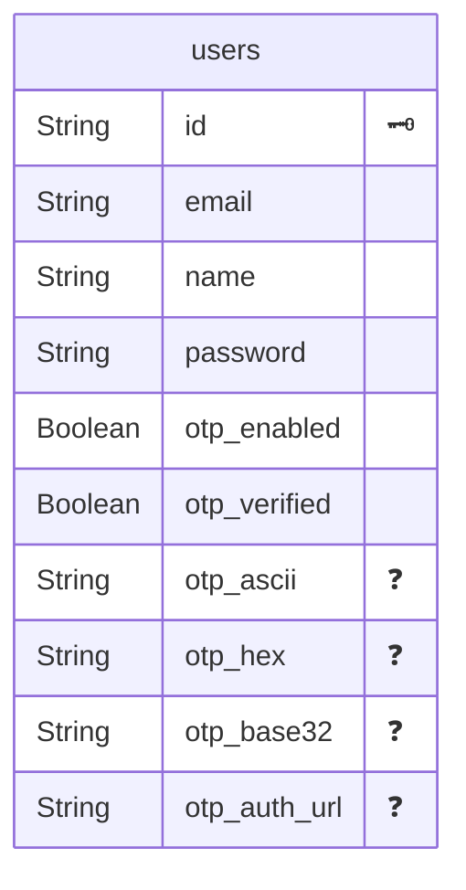

```mermaid
erDiagram

  "users" {
    String id "🗝️"
    String email
    String name
    String password
    Boolean otp_enabled
    Boolean otp_verified
    String otp_ascii "❓"
    String otp_hex "❓"
    String otp_base32 "❓"
    String otp_auth_url "❓"
    }

```
